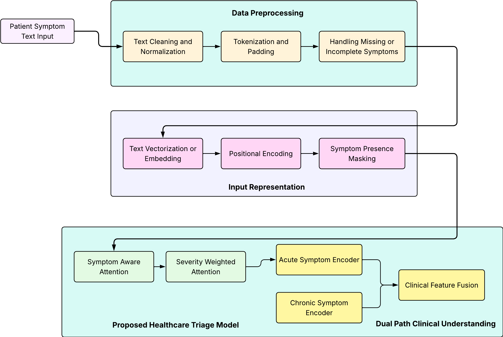

# 🏥 AI-Powered Symptom Checker & Triage Assistant

An intelligent NLP-based triage system that classifies patient-reported symptoms into appropriate urgency levels using a Transformer-based deep learning architecture.

---

## 📌 Project Overview

Healthcare systems are often overloaded with non-critical cases while emergency cases require immediate prioritization. This project aims to:

- Automatically analyze patient symptom descriptions  
- Classify cases into triage categories (e.g., Normal, Urgent, Emergency)  
- Reduce manual screening workload  
- Support early-stage clinical decision-making  

The system leverages modern Natural Language Processing (NLP) techniques with a Transformer-based architecture.

---

## 🧠 Model Architecture

The model pipeline consists of:

### 1️⃣ Text Preprocessing & Vectorization
- Tokenization  
- Vocabulary construction  
- Integer encoding  
- Sequence padding  

### 2️⃣ Embedding Layer
- Converts token IDs into dense vector representations  

### 3️⃣ Positional Encoding
- Injects sequence order information into embeddings  

### 4️⃣ Transformer Encoder Block
- Multi-Head Self-Attention  
- Feed Forward Network  
- Layer Normalization  
- Residual Connections  

### 5️⃣ Classification Head
- Global pooling  
- Dense layers  
- Softmax output layer  

---

## 🏗️ System Architecture

---

## 📊 Evaluation Metrics

The model evaluates performance using:

- Accuracy
- Precision (Macro & Weighted)
- Recall (Macro & Weighted)
- F1-Score (Macro & Weighted)
- Confusion Matrix
- Classification Report

`This ensures reliable evaluation even under class imbalance`

---

## 🎓 Academic Contributions

This project demonstrates:

- Transformer-based text classification
- Custom implementation of positional encoding
- Self-attention mechanism integration
- Modular deep learning pipeline design
- Handling of imbalanced multi-class classification
- Robust evaluation using macro and weighted metrics

---

## 🛠️ Tools Used

- TensorFlow
- Keras
- NumPy
- Pandas
- Scikit-learn

---

## 👨‍🎓 Author

Mohammed Misbahullah Sheriff
M.Tech – Artificial Intelligence
Semester IV Final Year Project
AI-Powered Clinical Triage Assistant
